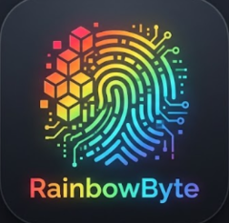

# RainbowByte - HDWID Checker

  
  
  **Ein professioneller HDWID-Checker für Hardware-Authentifizierung**

---

## 📋 Über das Projekt

RainbowByte ist ein leistungsstarker **HDWID (Hardware ID) Checker**, der Hardware-Informationen identifiziert, validiert und verwaltet. Das Tool hilft bei der Hardware-Authentifizierung und dem Tracking von Geräte-Identifikationen.

## ✨ Features

- ✅ Hardware-ID Erkennung und Analyse
- ✅ HDWID-Validierung
- ✅ Detaillierte Hardware-Informationen
- ✅ Einfache Bedienung
- ✅ Schnelle Verarbeitung

## 🚀 Installation
Download the exe from Releases
## 📝 Lizenz

Dieses Projekt ist unter der MIT-Lizenz lizenziert.

## 👤 Author

**GamerHD1005**

---

  Made with ❤️ by GamerHD1005

